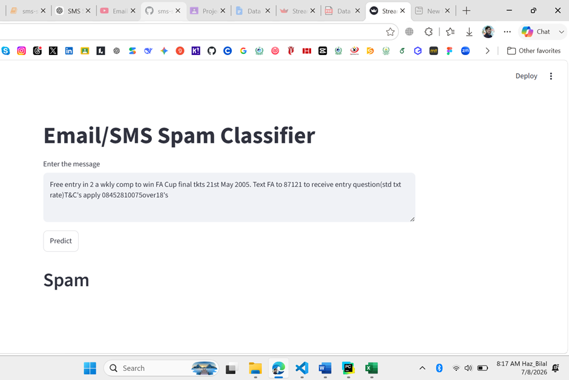

# 📧 SMS Spam Detection using Machine Learning

An end-to-end **Machine Learning** project that classifies SMS or Email messages as **Spam** or **Not Spam (Ham)** using **Natural Language Processing (NLP)** and **Machine Learning** techniques. The project includes data preprocessing, exploratory data analysis, model training, evaluation, and deployment using **Streamlit**.

---

## 📌 Project Overview

Spam messages often contain advertisements, phishing links, or fraudulent content that can compromise user security. This project develops an intelligent spam detection system capable of automatically classifying messages as **Spam** or **Ham**.

The system uses **TF-IDF Vectorization** for feature extraction and **Multinomial Naïve Bayes** as the final classification model.

---

## 🎯 Objectives

- Clean and preprocess SMS text data.
- Perform Exploratory Data Analysis (EDA).
- Apply Natural Language Processing (NLP) techniques.
- Convert text into numerical features using TF-IDF.
- Train and compare multiple machine learning models.
- Evaluate models using appropriate metrics.
- Deploy the model as a Streamlit web application.

---

## 📂 Dataset

- **Dataset:** SMS Spam Collection Dataset
- **Source:** Kaggle
- **Link:** https://www.kaggle.com/datasets/uciml/sms-spam-collection-dataset
- **Records:** 5,572 SMS messages
- **Classes:**
  - Ham (Not Spam)
  - Spam

---

## ⚙️ Technologies Used

- Python
- Pandas
- NumPy
- NLTK
- Scikit-learn
- Matplotlib
- Seaborn
- WordCloud
- Streamlit
- Pickle

---

## 🔄 Project Workflow

```
Problem Definition
        ↓
Dataset Collection
        ↓
Data Cleaning
        ↓
Exploratory Data Analysis
        ↓
Text Preprocessing
        ↓
TF-IDF Feature Extraction
        ↓
Model Building
        ↓
Advanced Models
        ↓
Model Evaluation
        ↓
Model Deployment
```

---

## 🧹 Data Preprocessing

The following preprocessing steps were applied:

- Convert text to lowercase
- Tokenization
- Remove special characters
- Remove stop words
- Remove punctuation
- Porter Stemming

---

## 📊 Exploratory Data Analysis

EDA included:

- Class distribution
- Character distribution
- Word distribution
- Correlation heatmap
- Pair plot
- Word Clouds
- Most frequent spam words
- Most frequent ham words

---

## 🤖 Machine Learning Models

### Baseline Models

- Gaussian Naïve Bayes
- Bernoulli Naïve Bayes
- Multinomial Naïve Bayes

### Advanced Models

- Random Forest
- Support Vector Machine (SVM)

---

## 📈 Model Performance

| Model | Accuracy | Precision |
|--------|-----------|------------|
| Gaussian Naïve Bayes | 87.33% | 51.60% |
| Bernoulli Naïve Bayes | **98.36%** | 99.19% |
| Multinomial Naïve Bayes | 97.10% | **100.00%** |
| Support Vector Machine | 97.58% | 97.48% |
| Random Forest | 97.68% | 97.50% |

### Final Selected Model

**Multinomial Naïve Bayes**

Reason:
- Achieved **100% Precision**
- Best suited for the imbalanced dataset
- Produced no false positive spam predictions

---

## 📊 Evaluation Metrics

- Accuracy
- Precision
- Confusion Matrix

---

## 💻 Streamlit Web Application

The trained model was deployed using **Streamlit**.

Features:

- Enter an SMS or Email message
- Click the **Predict** button
- Instantly classify the message as:
  - ✅ Not Spam (Ham)
  - ❌ Spam

---

## 📂 Project Structure

```text
Email_SMS_Spam_Classifier/
│
├── 📓 Email_SMS_Spam_Classifier.ipynb      # Jupyter Notebook
├── 🐍 PythonScript.py                      # Streamlit Application
├── 📄 README.md                            # Project Documentation
├── 📄 Requirements.txt                     # Required Libraries
├── 📊 spam.csv                             # Dataset
├── 🤖 model.pkl                            # Trained Model
├── 🔤 vectorizer.pkl                       # TF-IDF Vectorizer
├── 🖼️ image.png                            # Application Screenshot
├── 📑 Project Report Email_SMS Spam Classifier.pdf
├── 📝 Project Report Email_SMS Spam Classifier.docx
└── 📽️ SMS_Spam_Classifier_Presentation.pptx
```

---

## 🚀 Installation

Clone the repository

```bash
git clone https://github.com/BilalWazir033/Ai-Lab/tree/main/Semester_Project_DS(L)
```

Move to the project directory

```bash
cd SMS-Spam-Detection
```

Install dependencies

```bash
pip install -r requirements.txt
```

Run the application

```bash
streamlit run app.py
```

---

## 📷 Screenshots



- Home Page
- Spam Prediction
- Ham Prediction

---

## 📚 Future Improvements

- Hyperparameter tuning
- Deep Learning models (LSTM/BERT)
- Multi-language support

---

## 👨‍💻 Author

**Hazrat Bilal**,
**Haroon Ur Rashid**,
**Khalida Afghan**,
**Ilham Raza**  
Introduction to Data Science,
BS Computer Science, 
University of Engineering & Technology (UET), Peshawar,

---
## 📜 License

This project was developed for academic purposes as part of the **Data Science** course at the **University of Engineering & Technology, Peshawar**.

---
⭐ If you found this project helpful, consider giving it a star!


